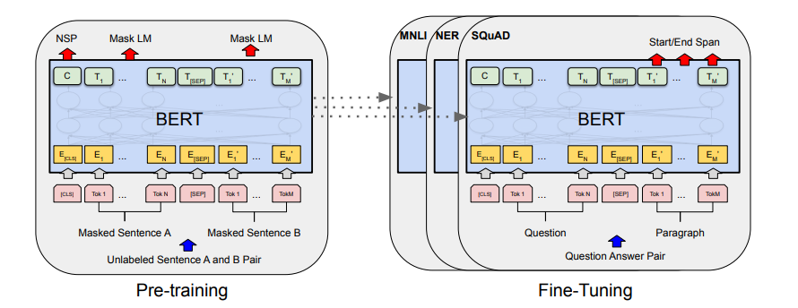

# TinyBERT

<p align="center">
  
  <!--  -->
</p>

---

## ❓ Why? (The Problem)
Modern search engines and QA systems often miss the mark when users phrase questions in unexpected ways. Relying on keyword overlap, they struggle to connect natural human language to the most relevant answers.

## 💡 What? (The Solution)
TinyBERT is a lightweight, BERT-inspired encoder trained to bridge this gap. By learning deep semantic representations, it retrieves the best-matching answer—even when the question and answer use different words. The model leverages Mean Negative Ranking Loss (MNRL) to align questions and answers in embedding space, making semantic search practical and efficient.

## 🚀 Project at a Glance
TinyBERT is designed for real-world question-answer matching:
- **Pretrained for stability:** First trained on a sentiment task to build robust representations.
- **Fine-tuned for retrieval:** Adapted to the Natural Questions dataset using MNRL for semantic similarity.
- **Resource-aware:** Uses gradient accumulation to simulate large batch training on limited hardware.
- **Results:** Achieves stable loss (~1.35) and retrieves semantically relevant answers, not just keyword matches.

## 🛠️ How Can You Use It?
You can use TinyBERT for semantic search via the provided inference script. Here’s how:

### 1. Command Line Inference
Run the following command to perform semantic search with a sample query and candidate passages:
```bash
python inference.py
```
This will load the pretrained model and print the most relevant passage(s) for the hardcoded query and chunks in the script. You can modify the `data` dictionary in `inference.py` to test your own queries and passages.

### 2. Programmatic Inference
You can also use the inference functions in your own Python code:
```python
from inference import load_model, load_tokenizer, semantic_search
import config

model = load_model(config.model_file_path)
tokenizer = load_tokenizer()

input_data = {
    "query": "Who founded a company?",
    "chunks": [
        "J.K. Rowling is the author of the Harry Potter series.",
        "The Eiffel Tower is located in Paris.",
        "Microsoft was founded by Bill Gates.",
        "The book was written by a British novelist."
    ],
    "top_k": 1
}

results = semantic_search(input_data)
print(results)
```
- `query`: The user question.
- `chunks`: List of candidate passages.
- `top_k`: Number of top matches to return.

**Example Output:**
```
model loaded successfully ✅
1 Match 👉👉 Microsoft was founded by Bill Gates.
```

### 3. Customization
- Change the query, candidate passages, or `top_k` as needed.
- For your own data, simply update the `input_data` dictionary.

### 4. Pretrained Weights
Download the pretrained model weights ([Google Drive link](https://drive.google.com/file/d/1HvRHkvLlA7P95zkMh673eSQUnUjERlVC/view?usp=sharing)) and place `model.pt` in the project root directory.

---

## 📊 Model Specifications
| Specification         | Value      |
|----------------------|------------|
| Encoder Layers       | 8          |
| Embedding Dimension  | 768        |
| Context Length       | 350        |
| Attention Heads      | 12         |
| Feedforward Dim      | 1600       |
| Vocabulary Size      | 30,000     |
| Special Tokens       | [UNK], [CLS], [SEP], [PAD] |
| Segments             | 2          |
| Dropout              | 0.1        |

---

## 🖼️ Model Architecture




<sub>
<b>Figure:</b> BERT model architecture (source: <a href="https://arxiv.org/abs/1810.04805">BERT: Pre-training of Deep Bidirectional Transformers for Language Understanding</a>, Devlin et al., 2018)
</sub>

---

## 📦 Setup

1. **Clone the repository**
   ```bash
   git clone https://github.com/yourusername/TinyBERT.git
   cd TinyBERT
   ```
2. **Install dependencies**
   ```bash
   pip install -r requirements.txt
   ```

---

## 📥 Download Pretrained Weights

> **Note:** The model weights (`model.pt`) are not included in this repository due to size constraints.

- Download the pretrained model weights from [Google Drive](https://drive.google.com/file/d/1ubKrR8eBtyJWYEPhhRy9_Pf4DXU_CEhw/view?usp=sharing) and place `model.pt` in the project root directory.

---

## 🛠️ Usage

- **Training:**
  ```bash
  python train.py
  ```
- **Inference:**
  ```bash
  python inference.py
  ```

---

## 📚 Datasets & Training Details
- **Pretraining for stability:** The model is first trained on a sentiment classification task to establish robust language representations.
- **Fine-tuning for semantic retrieval:** It is then fine-tuned on the [Natural Questions dataset](https://huggingface.co/datasets/sentence-transformers/natural-questions) using Mean Negative Ranking Loss to align questions and answers in embedding space.
- **Resource-aware training:** Gradient accumulation is used to simulate large batch sizes, making training feasible on limited hardware.

---

## 🎯 Applications
- FAQ retrieval
- Chatbot grounding
- Knowledge base search
- Any scenario requiring semantic matching of questions and answers

---

## 💡 Notes
- If you wish to use your own data or train from scratch, see `train.py` and `dataset.py` for details.


---

## 🤝 Contributing
Suggestions and feedback are most welcome!

---


